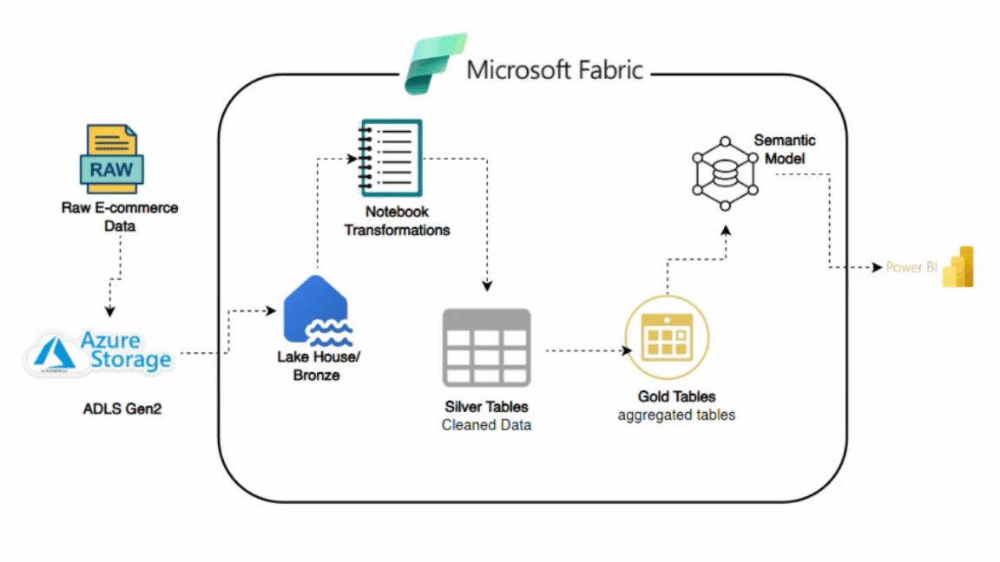

# Microsoft Fabric E-commerce Data Engineering Project

## Overview

This project demonstrates an end-to-end e-commerce data engineering solution built using Microsoft Azure and Microsoft Fabric.

The solution ingests raw e-commerce source files from an Azure Storage Account, processes the data through a Microsoft Fabric Lakehouse using a Medallion Architecture, transforms and cleans the data with PySpark notebooks, creates Gold-layer analytical tables, builds a semantic model, and makes the curated data available for Power BI reporting.

The project also uses Microsoft Fabric Git integration to version supported workspace items in GitHub.

---

## Project Architecture


---

## Technologies Used

- Microsoft Azure
- Azure Storage Account
- Azure Data Lake Storage Gen2
- Microsoft Fabric
- Fabric Data Factory
- Fabric Data Pipeline
- Fabric Lakehouse
- OneLake
- PySpark
- Apache Spark
- Delta Lake
- Power BI
- Git
- GitHub

---

## Source Data

The project uses five e-commerce source datasets:

```text
customers
orders
payments
support
web
```

The source files contain customer, order, payment, support-ticket and website-activity data.

The files are initially stored in Microsoft Azure Storage and are then ingested into Microsoft Fabric.

---

## Azure Storage

A Microsoft Azure Storage Account is used as the external source storage layer.

The source files are uploaded to Azure Storage before being processed by Microsoft Fabric.

This keeps the source storage layer separate from the Fabric analytics environment and represents a common cloud data engineering pattern.

---

## Microsoft Fabric Workspace

The Fabric workspace contains the main components used to process and analyse the e-commerce data.

The workspace includes:

- Fabric Lakehouse
- Fabric Data Pipeline
- Fabric Notebook
- Semantic Model
- Power BI reporting assets

The Fabric workspace is also connected to GitHub through Microsoft Fabric Git integration.

---

## Fabric Lakehouse

The Lakehouse provides the central storage and analytics layer for the project.

The solution follows a Medallion Architecture:

```text
Bronze
  |
  v
Silver
  |
  v
Gold
```

### Bronze Layer

The Bronze layer contains the raw ingested data.

The Fabric pipeline dynamically discovers the source files and copies them into the Lakehouse as Parquet files.

Bronze files include:

```text
customers.parquet
orders.parquet
payments.parquet
support_tickets.parquet
web_activities.parquet
```

The Bronze data is then converted into Delta tables for downstream processing.

---

## Metadata-Driven Fabric Pipeline

A metadata-driven Microsoft Fabric pipeline is used to ingest the source files.

The pipeline uses:

- Get Metadata
- ForEach
- Copy Data

`Get Metadata` dynamically discovers the available files.

`ForEach` loops through the discovered files.

`Copy Data` moves each source file into the Bronze layer of the Fabric Lakehouse and stores the data in Parquet format.

The pipeline was executed and verified successfully.

---

## Bronze Delta Tables

The Bronze Parquet files are loaded into Spark DataFrames and persisted as Delta tables.

The Bronze tables include:

```text
customers
orders
payments
support
web
```

Delta tables provide a structured foundation for the Silver-layer transformations.

---

## Silver Layer

The Silver layer contains cleaned and standardised datasets.

PySpark transformations are used to:

- Standardise text values
- Trim whitespace
- Normalise email addresses
- Standardise gender values
- Convert date fields into valid date types
- Convert numeric values into appropriate data types
- Handle invalid or missing values
- Remove duplicate records
- Remove records missing required identifiers
- Standardise payment methods and statuses
- Standardise support-ticket attributes
- Standardise website activity fields

The Silver tables include:

```text
silver_customers
silver_orders
silver_payments
silver_support
silver_web
```

These tables provide reliable and consistent data for the Gold analytical layer.

---

## Gold Layer

The Gold layer contains business-ready analytical datasets.

The main Gold tables are:

```text
gold_customer360
gold_customer_summary
```

These tables are designed for analytics, semantic modelling and Power BI reporting.

---

## Customer 360

The `gold_customer360` table combines information from:

- Customers
- Orders
- Payments
- Support tickets
- Website activity

This creates a consolidated view of customer interactions across the e-commerce platform.

The dataset can support analysis of:

- Customer profiles
- Purchase behaviour
- Payment behaviour
- Customer service activity
- Website engagement
- Customer journeys

---

## Customer Summary

The `gold_customer_summary` table provides an aggregated customer-level view.

It summarises customer activity across the e-commerce datasets and is designed to support high-level reporting and analysis.

The table is derived from the Customer 360 dataset and contains customer-level measures such as order, payment, support and website activity summaries.

---

## Semantic Model

A Microsoft Fabric semantic model named:

```text
ecommerce_semantic_model
```

is created from the Gold-layer analytical tables.

The semantic model provides a governed reporting layer between the Lakehouse and Power BI.

It allows report development to use business-ready data rather than connecting directly to raw Bronze or Silver datasets.

---

## Power BI Reporting

Power BI is used as the final reporting and visualisation layer.

The Power BI report connects to the semantic model created from the Gold tables.

The Gold layer provides clean, business-ready data so that complex transformations do not need to be performed inside Power BI.

---

## Data Quality and Validation

The notebook includes validation steps to confirm that the expected Bronze, Silver and Gold tables were created successfully.

The following tables are validated:

```text
customers
orders
payments
support
web
silver_customers
silver_orders
silver_payments
silver_support
silver_web
gold_customer360
gold_customer_summary
```

The validation checks the number of rows and columns available in each table.

This provides a simple final verification that the complete data transformation workflow has executed successfully.

---

## Git Integration

The Microsoft Fabric workspace is connected directly to GitHub using Fabric Git integration.

Repository:

```text
Microsoft-Fabric-Ecommerce
```

Branch:

```text
main
```

Microsoft Fabric Source Control is used to commit supported workspace items into the GitHub repository.

Project items versioned in Git include:

- Fabric Lakehouse definition
- Fabric Data Pipeline
- Fabric Notebook
- Semantic Model
- Project documentation

Git integration provides a version history of the Fabric solution while keeping the actual business data outside the source code repository.

---

## Repository Structure

A simplified representation of the GitHub repository is:

```text
Microsoft-Fabric-Ecommerce/
│
├── ecommerce_lakehouse.Lakehouse/
│
├── ecommerce_pipeline.DataPipeline/
│
├── ecommerce_semantic_model.SemanticModel/
│
├── notebook.Notebook/
│
└── README.md
```

The exact Fabric-generated folder names may vary depending on the item names used in the workspace.

---

## Project Outcome

The completed solution demonstrates an end-to-end Microsoft cloud data engineering workflow:

```text
Azure Storage
      |
      v
Microsoft Fabric Pipeline
      |
      v
Bronze Lakehouse Data
      |
      v
PySpark Transformations
      |
      v
Silver Delta Tables
      |
      v
Gold Analytical Tables
      |
      v
Semantic Model
      |
      v
Power BI
```

The project demonstrates practical experience with data ingestion, metadata-driven pipelines, Lakehouse architecture, PySpark transformations, Delta tables, Medallion Architecture, semantic modelling, reporting and source control.

---

## Author

**Iyeme Salubi**

Data Engineering Project

GitHub: [iyeme-dev](https://github.com/iyeme-dev)

---

## Repository

```text
Microsoft-Fabric-Ecommerce
```

This project forms part of my data engineering portfolio and demonstrates hands-on experience building an end-to-end Microsoft cloud data solution using Azure Storage, Microsoft Fabric, Medallion Architecture, Delta Lake, Power BI and GitHub.
